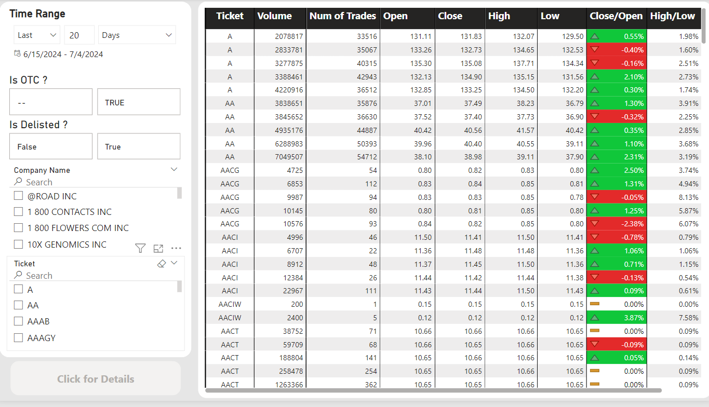

<h1>Introducing My Data Engieering Project</h1>

<h1>OverView</h1>

## 1 Process

- **_In this project I deploy an ETL process, initialize suitable storage and BI system for data of stock._** 
- **_The data in this project is extracted from data source of the US stock market._**
- **_I use various of tools including big data tools to perform complex tasks_**
- **_Integrate the automation workflow in this project to trigger tasks in right time_**
- **_Create dashboard model for analytics purpose_**

## 2 Project Architect

  

## 3 Data warehouse

 

## 4 Dashboards

    
    
    

    
    
    

    

 _link doashboards documents_
https://drive.google.com/file/d/1jW4DsNfhnjfpGlTw9MevLFmh5RhHWkMV/view?usp=drive_link

